# SimRacingAnalysis
SimRacingAnalysis contains some MATLAB code for estimating vehicle properties from sim racing games.

The `SimVehicleAnalysis` class provides functionality for:
* Estimating sprung and unsprung mass
* Estimating sprung mass longitudinal CoG position
* Estimating fuel density and fuel tank CoG longitudinal position
* Estimating body downforce and drag as a function of front ride height, rake angle, and velocity
* Estimating downforce and drag contributions of front/rear aero elements as function of setting (e.g. angle) and velocity

The above properties are estimated by doing prescribed maneuvers under different conditions to try and isolate changes. See the *Dataset Details* section below for more details.

This was created in an attempt to reverse engineer the Aston Martin GT3 car in *Assetto Corsa Competizione*, which there is sample log data for. All the plots below can reproduced by running the `run_acc_analysis.m` script (see the comment at the top about exluding front aero elements due to the Aston not having an adjustable front splitter).

It currently fully supports ACC, and it is possible to extend it to support iRacing or other sims by providing appropriate extensions to the `Setup` and `MotecHandler` classes.

This makes use of the [VehicleAnalysis](https://github.com/stevendaniluk/VehicleAnalysis) repository for various vehicle calculations.

## Setup
To clone this repository with the `VehicleAnalysis` submodule included run:
```
git clone --recursive git@github.com:stevendaniluk/SimRacingAnalysis.git
```

There is an `init_paths` function for adding the `VehicleAnalysis` directory to your MATLAB path, which is required to use the `VehicleAnalysis` library. This is run as part of the `run_acc_analysis` script.

## ACC - Aston Martin GT3 Analysis

### Chassis Analysis

First, the theoretical damper positions for completely uncompressed springs are estimated. This is done by taking damper position measurements when stationary under two different spring rate configurations. (see the [computeDamperZero](https://github.com/stevendaniluk/VehicleAnalysis/blob/master/Utils/computeDamperZero.m) function for details).

Next, the sprung mass properties can by directly estimated from stationary damper positions since the neutral damper position is known (see the [computeSprungMassProperties](https://github.com/stevendaniluk/VehicleAnalysis/blob/master/Utils/computeSprungMassProperties.m) function for details). A force and moment balance will provide the sprung mass and the longitudinal CoG position.

Lastly, the fuel density and tank CoG position are estimated in a similar fashion: by taking stationary damper position measurements under different fuel loads and doing another force and moment balance (see the [computeFuelProperties](https://github.com/stevendaniluk/VehicleAnalysis/blob/master/Utils/computeFuelProperties.m) function for details).

For the Aston Martin GT3 car the following properties were estimated:
* Sprung mass: 1,011 kg
* Unsprung mass: 393 kg
* Sprung mass CoG distance from front axle: 1.360 m
* Fuel density: 0.750 kg/L
* Fuel tank CoG distance from front axle: 2.075 m

### Aero Analysis
All of the aero analysis was performed by analyzing coast down runs on the main straight at Monza, which is likely the longest flattest section of any track.

During each run the front and rear downforce levels are estimated by monitoring the damper positions and utilizing the estimated sprung mass and the spring rates defined in game (ACC specifies wheel rates in the setup menu, so no conversion is needed).

The drag force is estimated by monitoring the longitudinal acceleration. Mechanical and tire rolling resistance is neglected here since the speeds during the coast down run is high. Also, there is not an easy way to isolate the mechanical losses to estimate them, as this would require very slow motion on either a flat area or an area with a known incline which cannot be known for certain in game.

All estimated functions for downforce and drag have the form below:

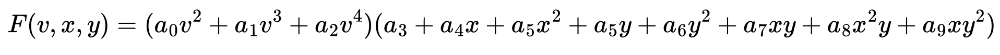

Where *v* is velocity, *x* and *y* are independent parameters, such as front ride height and rake angle. This was selected to enable the force to vary quadratically with each parameter (*x* and *y*) as well as enable the lift/drag coefficient to vary quadratically.

During estimation the above function is fit to emprical data in a least squares sense. Also, the above function is constrained such that there is zero force at zero velocity.

Below are 2D plots of the following attributes:
* Downforce [N]
* Drag [N]
* Aero Balance [%]
* Lift coefficient
* Drag coefficient
* Lift to drag ratio

All of these plots can be regenerated with the sample data provided.

Aero properties vs. rake angle with varying front ride height at a constant velocity of 180 km/h.
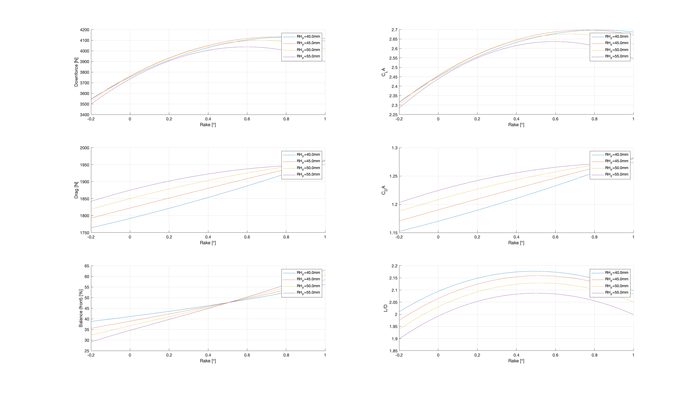

Aero properties vs. rake angle with varying velocity at a constant front ride height of 50mm.
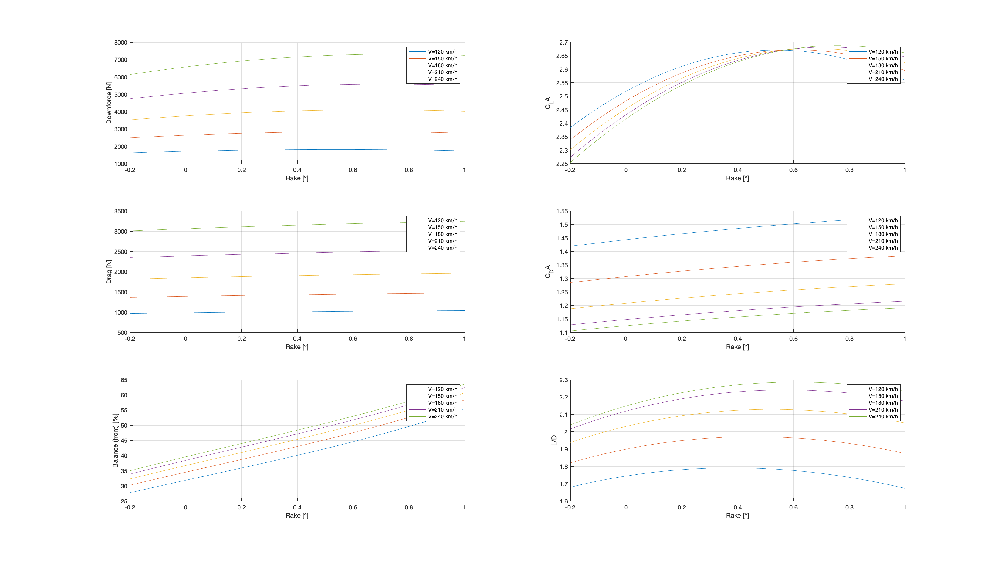

Aero properties vs. front ride height with varying velocity at a constant rake angle of 0.4 degrees.
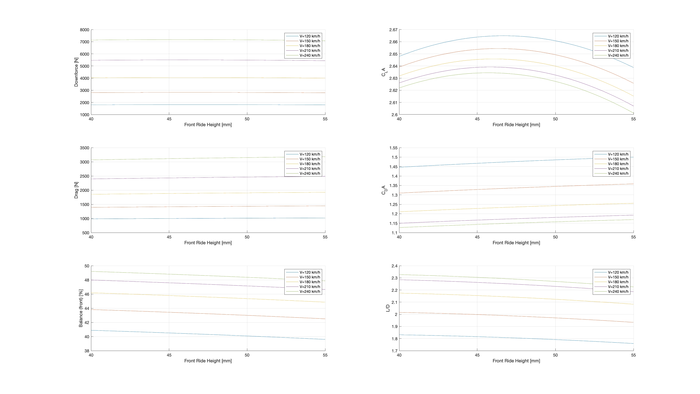

Relative change in aero properties for rear wing settings at varying velocities.
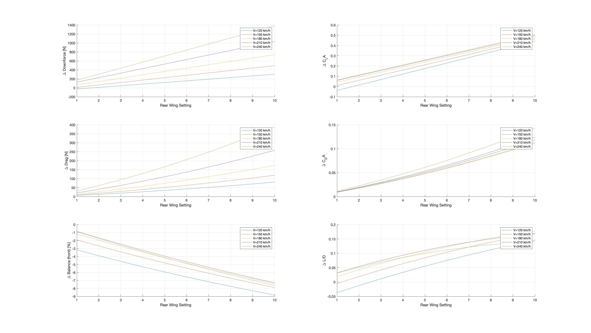

The two figures below show the measured and predicted downforce and drag forces for the chassis and rear wing element from various runs.

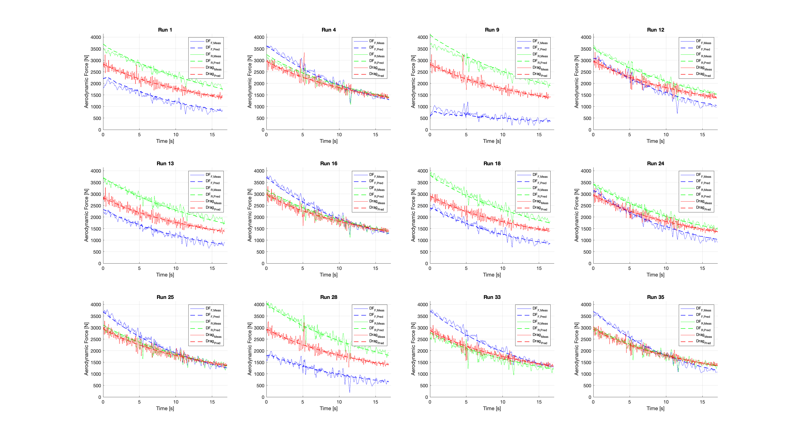

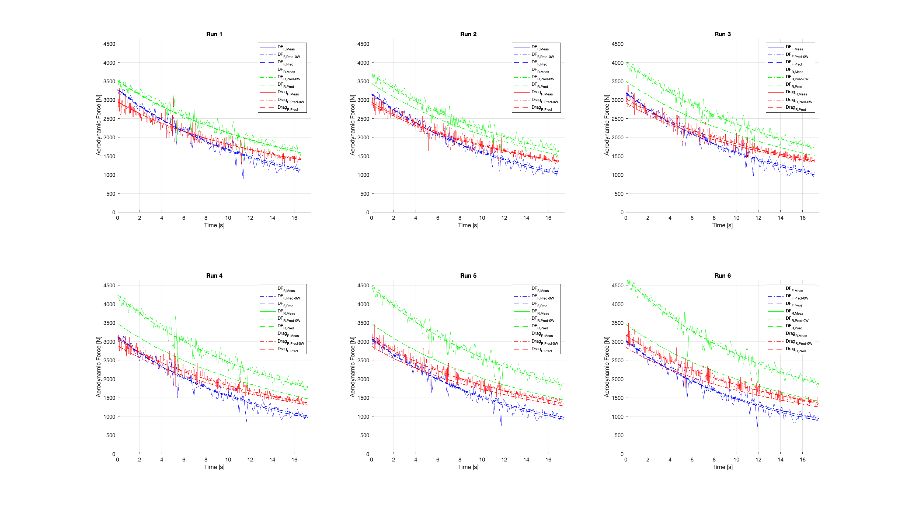

Lastly, the figure below shows the data coverage from all the coast down runs with varying ride height. Each cluster of points is from a single run, and the points are coloured for the current velocity. The provided dataset likely contains more runs than is necessary, but the volume is the result of repeated tests trying to get more even coverage.

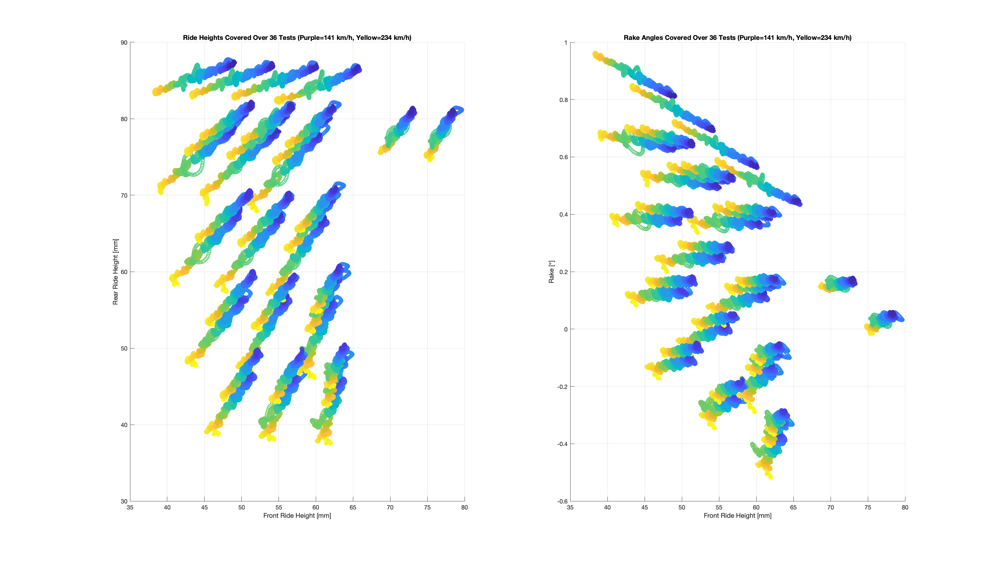

## Dataset Details
The analysis depends on a Excel spreadsheet detailing the log files and setup files for each maneuver, which will be parsed by the `SimVehicleAnalysis` class to load all the logs and setup data.

The logs are `.mat` files exported by [MoTeC i2](https://www.motec.com.au/i2/i2overview/), and the setups are the raw setup files generated by the game (in the case of ACC these are `.json` files).

The spreadsheet has a tab for each set of maneuvers, with a row for each different configuration. Green columns are for informational purposes only to help keep track of what each run was for. Only the white columns are processed.

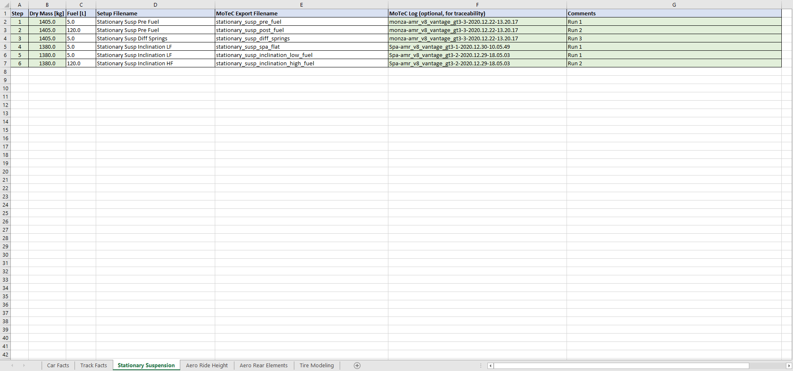

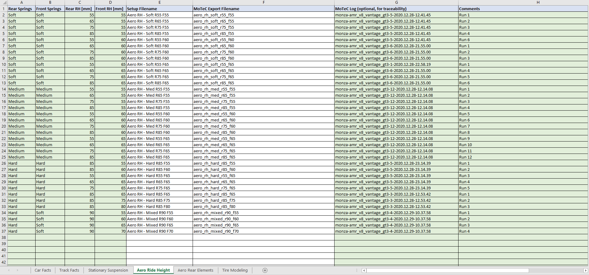

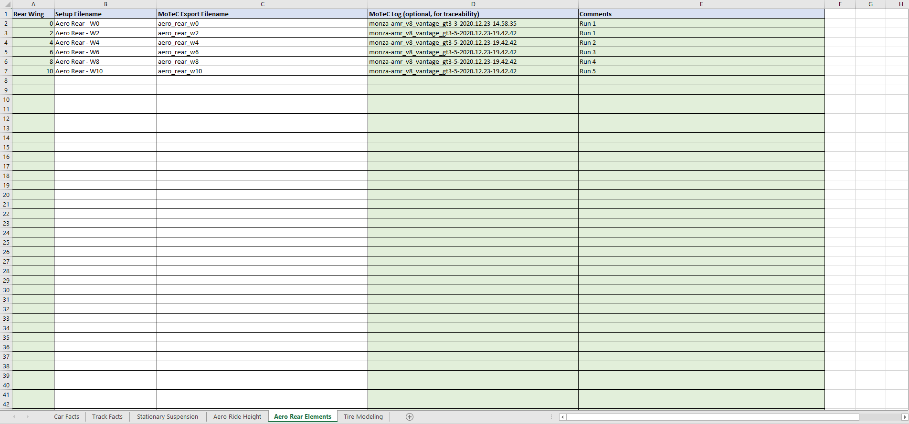

See the [Data Legend](https://github.com/stevendaniluk/SimRacingAnalysis/blob/master/ACC_data/aston_gt3/Data%20Legend.xlsx) spreadsheet included in the sample ACC Aston Martin GT3 data for an example.

The data directory is assumed to have the spreadsheet at the top level, and a directory for each maneuver containing all the log and setup files.

Example:
```
|_ Data Legend.xlsx
|_ Maneuver A
|____setup_1.json
|____setup_2.json
|____log_1.mat
|____log_2.mat
|_ Maneuver B
|____setup_1.json
|____setup_2.json
|____log_1.mat
|____log_2.mat
```

### Dataset Collection Instructions

#### Stationary Suspension
This test serves to estimate the sprung mass, sprung mass CoG position, fuel density, and fuel tank CoG position.

Procedure:
1. Select Monza, Practice, "Clear" conditions, and disable fuel consumption
1. Begin with any initial setup, but make sure it has the following settings:
   - All tires set to the same pressure
   - Fuel level set to 5 L
   - Pit stop strategy to change tires (same pressure) and fuel 120 L
   - Telemetry laps set to >2
1. Save this setup and record the details in the table under step #1 and #2
1. Start the car, drive out the pit exit and come to a stop near the end of the pit exit lane on the track, there is a line crossing the pit exit lane near the end close to the 150m braking board that can be used as a stop point marker
1. Turn the engine off and wait 10s
1. Drive the rest of the lap, enter the pits, and complete the pit stop to change tires and fuel up
1. Exit the pits and stop at the same spot as in step #5
1. Turn the engine off and wait 10s
1. Drive the rest of the lap and cross the start/finish line
1. Modify your setup to change both the front and rear spring rates
1. Save the modified setup and record the details under Setup #3
1. Drive to the same measurement point, turn off the engine, and wait 15s
1. Drive the rest of the lap and cross the start/finish line
1. Open the MoTeC log in i2, you should have 3 laps logged. For each lap, export the data (File --> Export) for the current lap as a MATLAB file at the highest rate possible. Record the name of each exported log in the sheet.

#### Aero Ride Height
This test serves to estimate the aerodyanmic properties of the chassis (i.e. everything except for additional adjustable aero elements like wings) by performing a series of coast down runs under different chassis configurations.

Good data coverage for this test means trying to get a good distribution of data over all front and rear ride heights and velocities. This can be down be repeating several coast down runs using different static ride heights and spring rates (so the suspension compresses different amounts during each run).

Procedure:
1. Select Monza, Hot Lap, "Clear" conditions
1. Configure your setup to have your desired ride height and spring rates for the current run, and make sure it also has the following:
   - Rear wing and front splitter set to their minimum levels
   - Telemetry laps set to >2
1. Save this setup, record the name in a new row on the spreadsheet and note the springs and ride heights (for informational purposes only, these will be captured in the setup file)
1. Begin a new hotlap and right when you reach the start/finish line release the throttle, depress the clutch, and cost for as long as you can (you can cut the chicane at T1-2 and go straight through to Curva Grande)
1. Finish the lap, this must be down for the MoTeC data to be logged
1. Exit to return back to the garage/setup page
1. Open the log in MoTeC i2, export the data (File --> Export) for that lap as a MATLAB file at the highest rate possible. Record the name of the exported log in the sheet.
1. Return to step #2 and repeat with a different configuration of ride heights and spring rates until you have enough data

#### Aero Rear Elements
This test serves to estimate the aerodyanmic contributions of adjustable rear aero elements. The same test/process can be applied to front aero elements. The test is very similar to the *Aero Ride Height* test in that it utilizies coast down runs. Although not as many variations are needed, just one coast down run for each wing/splitter setting.

Procedure:
1. Select Monza, Hot Lap, "Clear" conditions
1. Configure your setup to have your desired wing/splitter setting for the current run, and make sure it also has the following:
   - Constant ride height between tests
   - Constant setting for any other aero elements between tests
   - Telemetry laps set to >2
1. Save this setup, record the name in a new row on the spreadsheet and note the aero element setting (for informational purposes only, this will be captured in the setup file)
1. Begin a new hotlap and right when you reach the start/finish line release the throttle, depress the clutch, and cost for as long as you can (you can cut the chicane at T1-2 and go straight through to Curva Grande)
1. Finish the lap, this must be down for the MoTeC data to be logged
1. Exit to return back to the garage/setup page
1. Open the log in MoTeC i2, export the data (File --> Export) for that lap as a MATLAB file at the highest rate possible. Record the name of the exported log in the sheet.
1. Return to step #2 and repeat with a different wing/splitter setting until you have enough data
